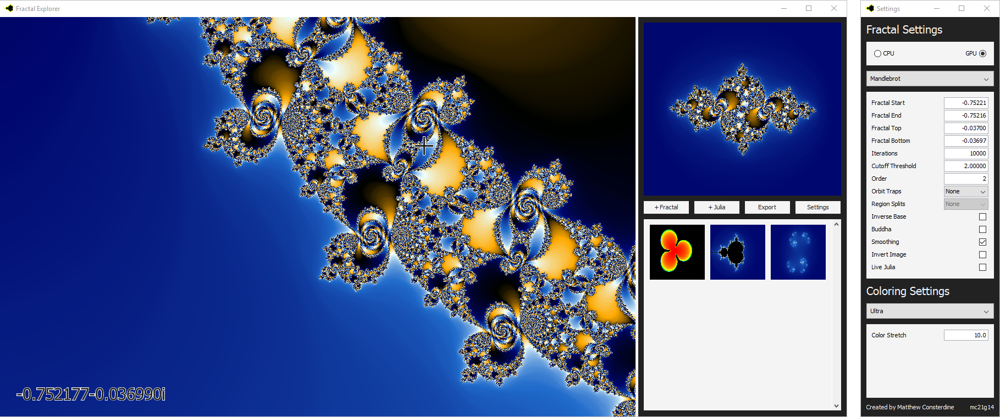

Fractal Explorer
================

A Java, GPU accelerated fractal explorer.

# Usage

## Fractal Window

 * You can zoom into and investigate any fractal that is visible on your screen either with your
   mouse or with keyboard shortcuts
 * To save a fractal for later, click either of the favourite buttons to add it to your favourites.
   To load it left click on it, to delete it right click. Any changes you make will be saved for
   when you next use the program.
 * You can export your current fractals as an image, click the Export button. You will be prompted
   to pick a size and a file to save too. Current settings will be used, if you have enough RAM
   allocated to Java, nearly any size should work.
 * To show/hide the settings dialog, simply click the Settings button. Alternatively, click the X
   in the top right of the settings dialog.

### Keyboard

| Shortcut    | Description                                                                          |
|-------------|--------------------------------------------------------------------------------------|
| H/Home/Esc  | Return to start of the fractal, useful if you are too deep and you want out          |
| W/I/Up      | Move the camera up to reveal the parts of the fractal that are above                 |
| S/K/Down    | Move the camera down to reveal the parts of the fractal that are below               |
| A/J/Left    | Move the camera left to reveal the parts of the fractal that are left                |
| D/L/Right   | Move the camera right to reveal the parts of the fractal that are right              |
| +           | Zoom in to the fractal                                                               |
| -           | Zoom out of the fractal                                                              |

### Mouse

 You can drag the mouse to select a region of the fractal to zoom into, and use the scroll-wheel to
 zoom in and out of the fractal. If you click on the fractal the selected point and julia set will
 then update the selected point.
